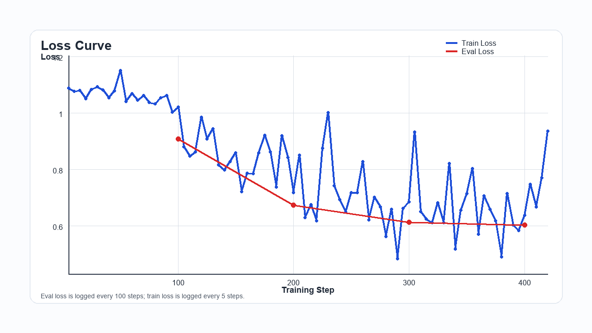
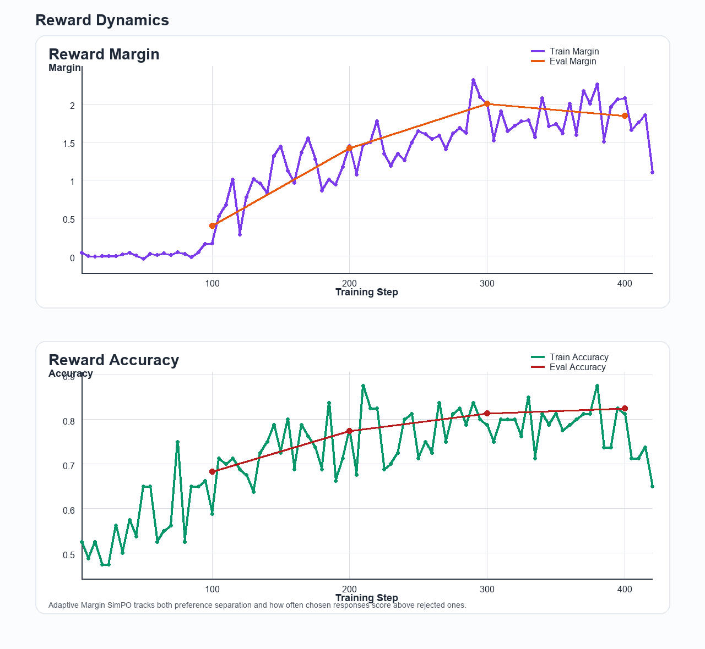
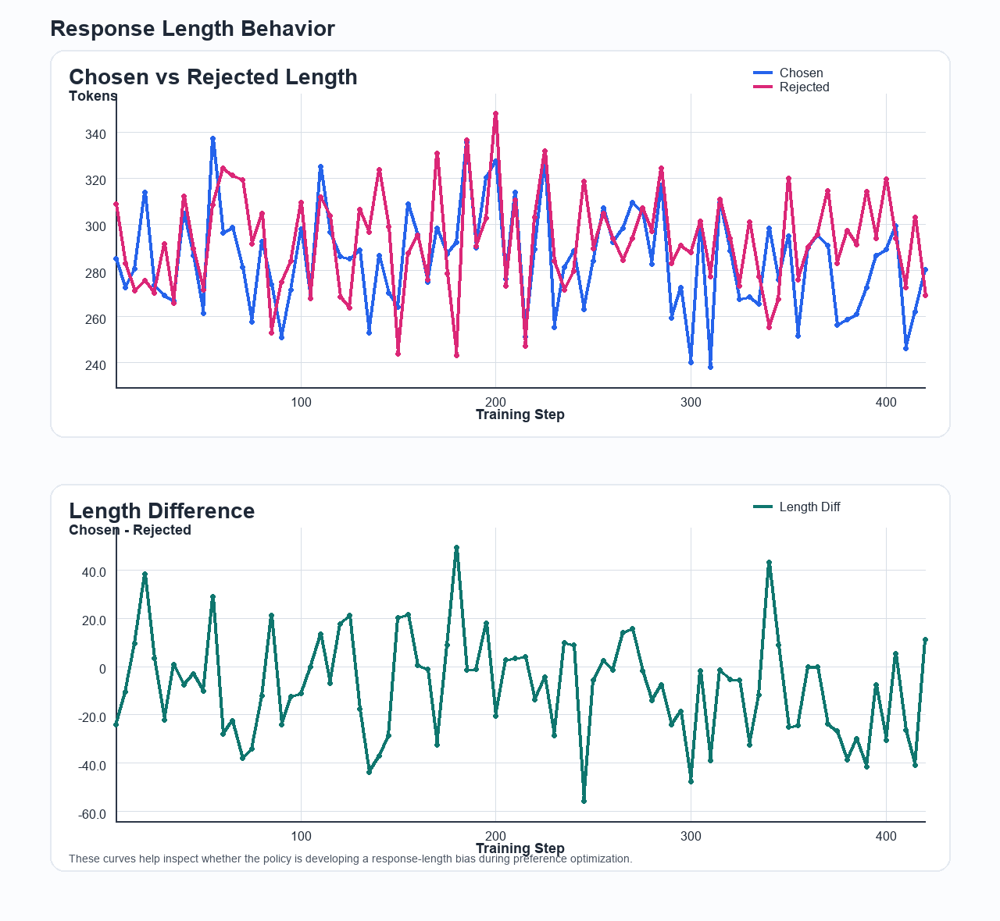
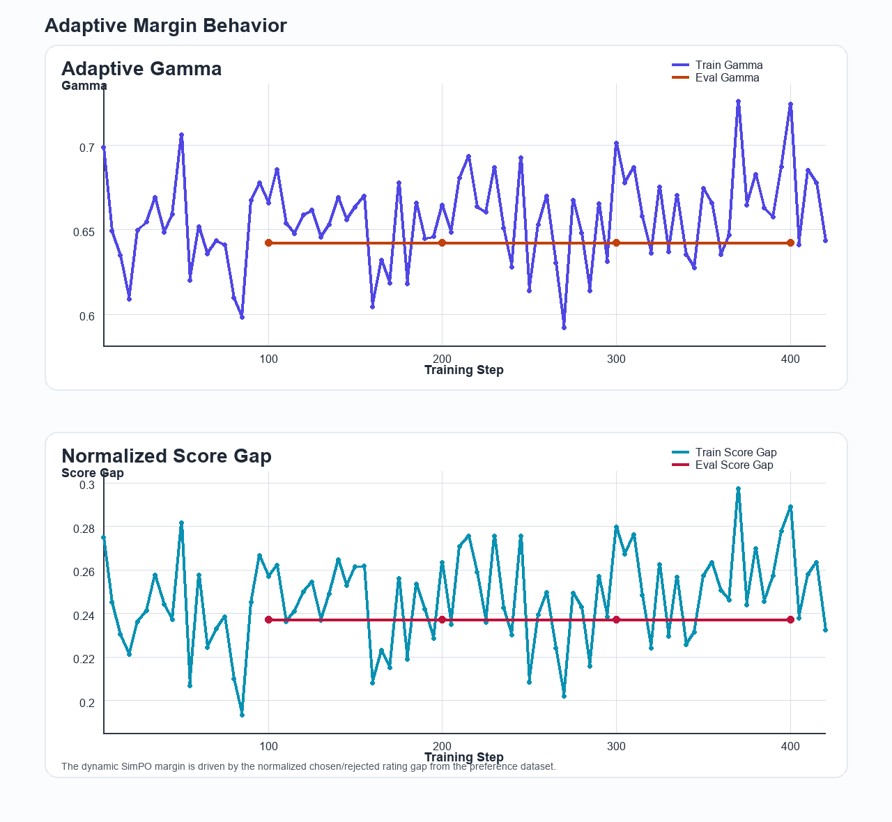
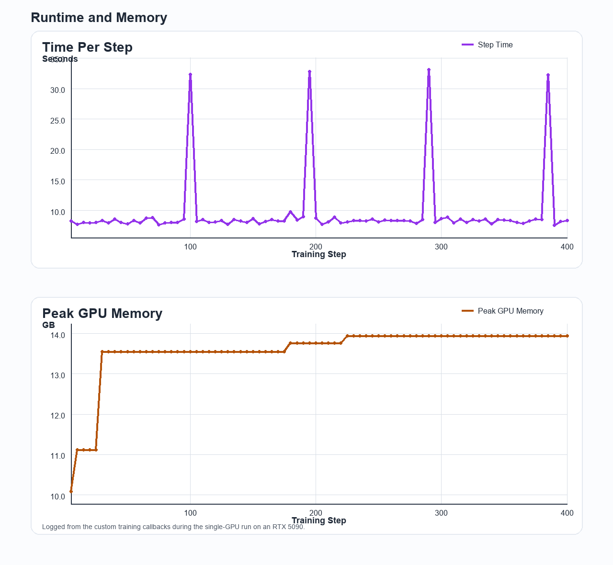

# Adaptive Margin SimPO + QLoRA — Llama-3-8B-Instruct

Fine-tunes **`meta-llama/Meta-Llama-3-8B-Instruct`** with **Adaptive Margin SimPO** and **QLoRA** on [`argilla/dpo-mix-7k`](https://huggingface.co/datasets/argilla/dpo-mix-7k). The current trainer is reference-free: it length-normalizes chosen/rejected log-probs, scales them by `beta`, and replaces the fixed SimPO margin with a sample-wise adaptive `gamma` derived from the chosen/rejected rating gap.

## Setup

```bash
python -m venv .venv && source .venv/bin/activate
pip install -r requirements.txt
```

> Requires a CUDA GPU. For non-bf16 GPUs set `train.bf16=false` and `train.fp16=true`. If you use the gated Llama 3 weights from Hugging Face, run `huggingface-cli login` first. A local model path also works via `--override model.model_name_or_path=/path/to/model`.

## Dataset

The default dataset is `argilla/dpo-mix-7k`, using the `train` / `test` splits from the Hub.

Adaptive Margin SimPO expects these fields:

- `prompt`
- `chosen`
- `rejected`
- `chosen_rating`
- `rejected_rating`

To switch to local JSONL files, set `data.use_hub_dataset: false` and point `data.train_file` / `data.eval_file` to files with the same schema. Score column names are configurable through:

- `data.chosen_score_column`
- `data.rejected_score_column`

If a dataset does not provide scores, the trainer falls back to:

- `simpo.fallback_chosen_score`
- `simpo.fallback_rejected_score`

## Training

```bash
bash scripts/train_llama3_instruct.sh
```

Or run the trainer directly with overrides:

```bash
python -m src.train_dpo \
  --config configs/dpo_qlora_llama3_8b.yaml \
  --override model.model_name_or_path=/path/to/model \
  --override data.use_hub_dataset=false \
  --override data.train_file=/path/to/train.jsonl \
  --override data.eval_file=/path/to/eval.jsonl
```

Adapter weights are saved to `train.output_dir` (default: `outputs/llama3_8b_instruct_dpo_qlora`).

## Inference

Generate responses from the trained LoRA adapter:

```bash
bash scripts/infer_dpo.sh \
  --adapter-path outputs/llama3_8b_instruct_dpo_qlora/checkpoint-421 \
  --output-file outputs/inference/alpaca_eval_dpo_responses.jsonl
```

To run inference on a local prompt file instead:

```bash
python -m src.infer_dpo \
  --adapter-path outputs/llama3_8b_instruct_dpo_qlora/checkpoint-421 \
  --input-file data/my_prompts.jsonl \
  --output-file outputs/inference/my_prompts_dpo_responses.jsonl
```

## Monitoring

TensorBoard works out of the box:

```bash
tensorboard --logdir outputs/
```

Key training metrics logged by the current trainer:

- `train/loss`, `eval/loss`
- `train/rewards/margins`, `eval/rewards/margins`
- `train/rewards/accuracies`, `eval/rewards/accuracies`
- `train/response_lengths/*`, `eval/response_lengths/*`
- `train/objective/gamma`, `eval/objective/gamma`
- `train/objective/score_gap`, `eval/objective/score_gap`

To export static PNG plots from a local TensorBoard event file:

```bash
python scripts/export_training_plots.py \
  --event-file artifacts/training_metrics/<run>/events.out.tfevents... \
  --log-file artifacts/training_metrics/<run>/simpo_train_local.log \
  --output-dir artifacts/training_metrics/<run>/plots
```

## Config (`configs/dpo_qlora_llama3_8b.yaml`)

| Section | Key fields |
|---|---|
| `model` | `model_name_or_path`, `bnb_4bit_*` |
| `data` | `use_hub_dataset`, `hub_dataset_name`, `hub_train_split`, `hub_eval_split`, `chosen_score_column`, `rejected_score_column` |
| `lora` | `r`, `lora_alpha`, `lora_dropout`, `target_modules` |
| `train` | `output_dir`, `learning_rate`, `beta`, `bf16`, `max_length`, `logging_steps`, `save_steps`, `eval_steps` |
| `simpo` | `gamma_base`, `gamma_max`, `margin_slope`, `margin_offset`, `fallback_*_score` |

## Latest Training Run

The latest captured run artifacts are stored in:

- `artifacts/training_metrics/2026-04-11-llama3_8b_instruct_dpo_qlora/`
- `artifacts/training_metrics/2026-04-11-llama3_8b_instruct_dpo_qlora/plots/`

Summary of that run:

| Metric | Value |
|---|---|
| Runtime | `3974.3s` (`66.24 min`) |
| Final train loss | `0.8150` |
| Final eval loss | `0.6021` |
| Final eval reward margin | `1.8431` |
| Final eval reward accuracy | `0.8253` |
| Final eval adaptive gamma | `0.6424` |
| Peak GPU memory | `13.9383 GB` |

## Training Curves

<p align="center">
  
  
</p>

<p align="center">
  
  
</p>

<p align="center">
  
</p>

## Common Issues

| Issue | Fix |
|---|---|
| OOM | Reduce `train.max_length` or `per_device_train_batch_size`; increase `gradient_accumulation_steps` |
| Flash attention error | Set `model.use_flash_attention_2: false` |
| Dtype mismatch | Switch `bf16` / `fp16` based on GPU support |
| Model auth failure | Run `huggingface-cli login` and accept the license, or use a local model path |
| Hub dataset unavailable | Set `data.use_hub_dataset: false` and use local JSONL files |
| Missing score columns | Set `data.chosen_score_column` / `data.rejected_score_column`, or rely on `simpo.fallback_*_score` |
